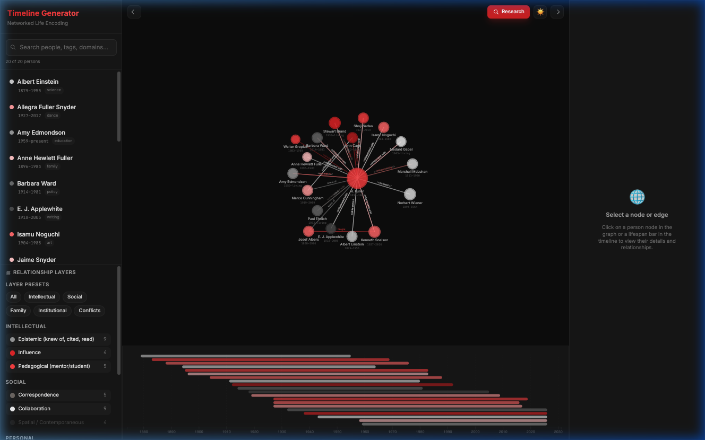
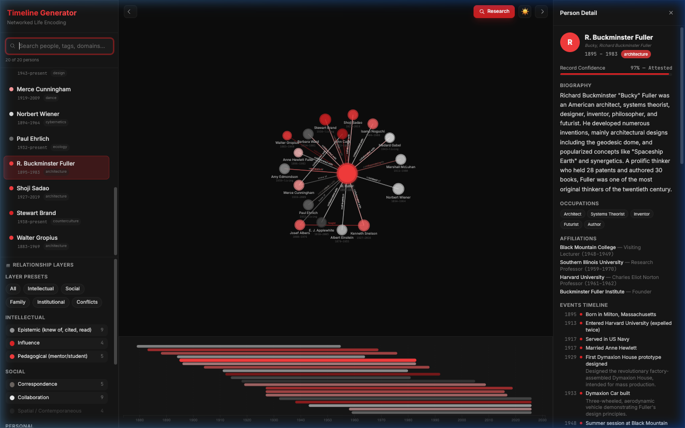
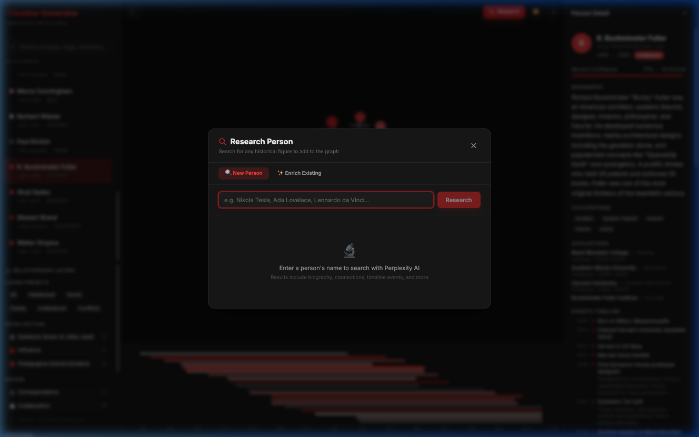
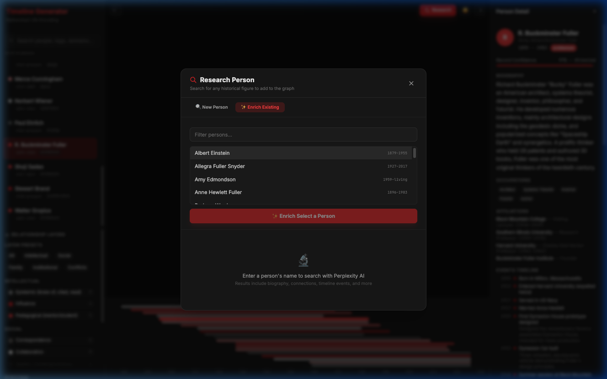
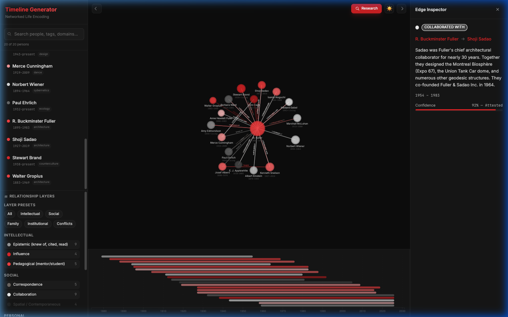
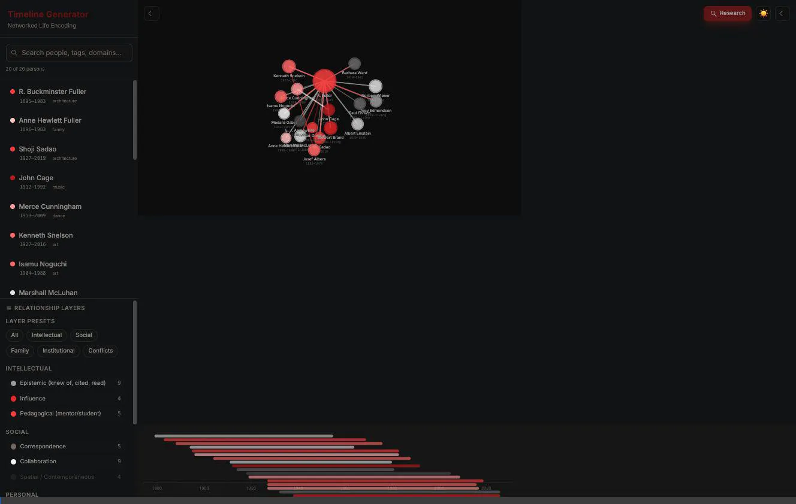

# Timeline Generator — Documentation

Comprehensive documentation for the Timeline Generator knowledge graph system.

## Quick Links

| Document | Description |
|---|---|
| [Getting Started](./getting-started.md) | Installation, setup, and first run |
| [Architecture](./architecture.md) | System design, monorepo structure, data flow |
| [Data Model](./data-model.md) | Person, Edge, Event schemas and taxonomy |
| [API Reference](./api-reference.md) | 18 REST endpoint documentation |
| [Research](./research.md) | Perplexity AI research & entity enrichment |
| [Seed Data](./seed-data.md) | Fuller network dataset specification |
| [Frontend Guide](./frontend-guide.md) | React components, D3 visualization, state management |
| [Backend Guide](./backend-guide.md) | Fastify server, Neo4j store, route handlers |
| [Configuration](./configuration.md) | Environment variables, Docker, Vite, TypeScript |
| [Testing](./testing.md) | 204-test suite across 4 packages |
| [Contributing](./contributing.md) | Code style, PR process, development workflow |
| [Roadmap](./roadmap.md) | Phase 0–3 feature plans |
| [Glossary](./glossary.md) | Domain terminology and definitions |

## Project Overview

Timeline Generator is a browser-native knowledge graph that encodes human lives as first-class temporal objects and weaves them into richly typed relational networks. It treats biography not as linear text but as a **node in a multidimensional graph** — alive with dated events, weighted relationships, epistemic provenance, and searchable context.

### Current State

- **20 persons** in the Buckminster Fuller network
- **42+ typed relationship edges** across 10 categories
- **46+ temporal events** (births, deaths, publications, inventions, awards)
- **Neo4j graph database** with BFS traversal and shortest path
- **D3 force-directed visualization** with domain coloring, edge type labels, and layer system
- **SVG timeline** with lifespan bars and brush-based time filtering
- **Perplexity AI research** — search, add, and enrich persons in the graph
- **204 tests** across shared, backend, and seed-data packages (7 test files)
- **`run.sh` orchestrator** — all-in-one preflight, test, and launch script
- **RightPanel Enrich** — one-click `✨ Enrich Profile` button in the person detail panel

### Screenshots

See the [root README](../README.md) for full screenshots and demo videos, or browse `assets/` directly.

| Screenshot | Description |
|---|---|
|  | Main graph view with edge type labels |
|  | Person detail panel |
|  | Research modal — New Person |
|  | Research modal — Enrich Existing |
|  | Edge inspector |

### Demo Videos

| Video | Description |
|---|---|
|  | UI improvements walkthrough |
|  | Application feature walkthrough |
|  | Full timeline and graph demo |
